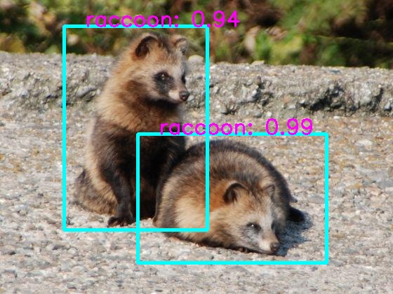

# Raccoon Detection 

Raccoon Detector aims to classify and detect raccoon in an image with REST APIs using state of the art SSD-MobileNet deep learning architecture

## 🚀&nbsp; Installation

1. Clone the repo
```
$ git clone https://github.com/NISHANTSHRIVASTAV/RaccoonDetection.git
```

2. Change your directory to the cloned repo 
```
$ cd RaccoonDetection
```

3. Now, run the following command in the terminal/command prompt to install the required libraries
```
$ pip install -r requirements.txt
```

## :bulb: Working

### Generate Training Files

Go to dataset directory i.e. dataset\VOC2007 and run
```
$ python vision\datasets\generate_vocdata.py labels.txt
```
### Train the model with multiple GPUs
```
$ python train_ssd.py --dataset-type=voc --data=dataset\VOC2007\ --model-dir=models\custom_trained_model\ --batch-size=36 --epochs=150 --workers=0 --use-cuda=True --pretrained-ssd=models\pretrained_model\mobilenet-v1-ssd-mp-0_675.pth --gpu-devices 0 1 2 
```
### Inference/Prediction
To run the Raccoon Detector Inference Flask API Engine which saves the response with bounding boxes in \results directory
```
$ python app.py 
```

### Evaluation
To e valuate the Raccoon Detector trained model
```
$ python eval_ssd.py --net=mb1-ssd --trained_model=models\custom_trained\mb1-ssd-Epoch-165-Loss-1.3442652225494385.pth --dataset_type=voc --dataset=dataset\VOC2007\ --label_file=labels\labels.txt --use_cuda=False --eval_dir=eval 
```

## REST APIs

### Detect Raccoon (Single Input Image)

#### Request

`POST /detect`

    curl --request POST --url http://localhost:5000/detect --header 'nmsThreshold: 0.5' --header 'netType: mb1-ssd' --header 'deviceType: cpu' --header 'Content-Type: multipart/form-data; boundary=---011000010111000001101001' --form 'file=@input_image.jpg' 

#### Response

```json
{
    "error": false,
    "inference_time": 0.23,
    "output_image": "ae49f07e-7611-11ec-b929-000c29b400a7.jpg",
    "prediction_count": {
        "raccoon": 2
    },
    "predictions": [
        {
            "confidence": "99.11605715751648",
            "label": "raccoon",
            "x1": 196,
            "x2": 465,
            "y1": 191,
            "y2": 375
        },
        {
            "confidence": "93.75631213188171",
            "label": "raccoon",
            "x1": 91,
            "x2": 295,
            "y1": 37,
            "y2": 328
        }
    ],
    "status": "ok"
}
```

### Detect Raccoon (Batch Input on Test Images)

#### Request

`POST /detect_batch`

    curl --request POST --url http://localhost:5000/detect_batch` --header 'nmsThreshold: 0.5' --header 'netType: mb1-ssd' --header 'deviceType: cpu' --header 'Content-Type: multipart/form-data; boundary=---011000010111000001101001' --form 'files=@input_images.jpg' 

#### Response

```json
{
    "batch_size": 17,
    "error": false,
    "predictions": [
        {
            "error": false,
            "inference_time": 0.22,
            "input_image": "raccoon-6_jpg.rf.1166741c763a5ea5695a235e0262444e.jpg",
            "output_image": "6ed14ba4-760e-11ec-a0e5-000c29b400a7.jpg",
            "prediction_count": {
                "raccoon": 1
            },
            "predictions": [
                {
                    "confidence": "99.52923059463501",
                    "label": "raccoon",
                    "x1": 13,
                    "x2": 314,
                    "y1": 44,
                    "y2": 313
                }
            ],
            "status": "ok"
        },
        {
            "error": false,
            "inference_time": 0.14,
            "input_image": "raccoon-7_jpg.rf.8da910bffa4e71a9b7973af3fee093cd.jpg",
            "output_image": "6ee6a8ca-760e-11ec-8d76-000c29b400a7.jpg",
            "prediction_count": {
                "raccoon": 1
            },
            "predictions": [
                {
                    "confidence": "93.42681765556335",
                    "label": "raccoon",
                    "x1": 38,
                    "x2": 293,
                    "y1": 69,
                    "y2": 263
                }
            ],
            "status": "ok"
        },
        {
            "error": false,
            "inference_time": 0.18,
            "input_image": "raccoon-57_jpg.rf.9a1351ac4447ff21d4390fd8e323e7bf.jpg",
            "output_image": "6f03a66e-760e-11ec-a4db-000c29b400a7.jpg",
            "prediction_count": {
                "raccoon": 1
            },
            "predictions": [
                {
                    "confidence": "99.94648098945618",
                    "label": "raccoon",
                    "x1": 29,
                    "x2": 633,
                    "y1": 0,
                    "y2": 426
                }
            ],
            "status": "ok"
        },
        {
            "error": false,
            "inference_time": 0.13,
            "input_image": "raccoon-58_jpg.rf.d06ce184082977965e0659f0444ed3c9.jpg",
            "output_image": "6f190336-760e-11ec-8e74-000c29b400a7.jpg",
            "prediction_count": {
                "raccoon": 1
            },
            "predictions": [
                {
                    "confidence": "99.99094009399414",
                    "label": "raccoon",
                    "x1": -11,
                    "x2": 206,
                    "y1": 2,
                    "y2": 218
                }
            ],
            "status": "ok"
        },
        {
            "error": false,
            "inference_time": 0.13,
            "input_image": "raccoon-59_jpg.rf.079100ee6a52181388c3677744a5c16a.jpg",
            "output_image": "6f2e60b8-760e-11ec-ab1e-000c29b400a7.jpg",
            "prediction_count": {
                "raccoon": 1
            },
            "predictions": [
                {
                    "confidence": "98.5691487789154",
                    "label": "raccoon",
                    "x1": -12,
                    "x2": 451,
                    "y1": 7,
                    "y2": 464
                }
            ],
            "status": "ok"
        },
        {
            "error": false,
            "inference_time": 0.13,
            "input_image": "raccoon-60_jpg.rf.ee59d00b346bda9929f905defbf367ee.jpg",
            "output_image": "6f43bcda-760e-11ec-8687-000c29b400a7.jpg",
            "prediction_count": {
                "raccoon": 1
            },
            "predictions": [
                {
                    "confidence": "96.03070020675659",
                    "label": "raccoon",
                    "x1": 53,
                    "x2": 202,
                    "y1": 31,
                    "y2": 120
                }
            ],
            "status": "ok"
        },
        {
            "error": false,
            "inference_time": 0.14,
            "input_image": "raccoon-61_jpg.rf.3b2ab56ca1eccdae9144b40b65e0e23b.jpg",
            "output_image": "6f591962-760e-11ec-808f-000c29b400a7.jpg",
            "prediction_count": {
                "raccoon": 1
            },
            "predictions": [
                {
                    "confidence": "99.94261264801025",
                    "label": "raccoon",
                    "x1": 90,
                    "x2": 193,
                    "y1": 41,
                    "y2": 148
                }
            ],
            "status": "ok"
        },
        {
            "error": false,
            "inference_time": 0.15,
            "input_image": "raccoon-62_jpg.rf.a055b6e5102faea5fa404472bbc7a5fc.jpg",
            "output_image": "6f6ffccc-760e-11ec-a266-000c29b400a7.jpg",
            "prediction_count": {
                "raccoon": 1
            },
            "predictions": [
                {
                    "confidence": "99.81592297554016",
                    "label": "raccoon",
                    "x1": 64,
                    "x2": 555,
                    "y1": 25,
                    "y2": 401
                }
            ],
            "status": "ok"
        },
        {
            "error": false,
            "inference_time": 0.13,
            "input_image": "raccoon-63_jpg.rf.ee21dbec555f80345f8537eac0e37c3d.jpg",
            "output_image": "6f86e02c-760e-11ec-b93c-000c29b400a7.jpg",
            "prediction_count": {
                "raccoon": 1
            },
            "predictions": [
                {
                    "confidence": "94.03764009475708",
                    "label": "raccoon",
                    "x1": 101,
                    "x2": 432,
                    "y1": 84,
                    "y2": 336
                }
            ],
            "status": "ok"
        },
        {
            "error": false,
            "inference_time": 0.18,
            "input_image": "raccoon-64_jpg.rf.47ce5bdc84c74f8c705fd2c74aede4b2.jpg",
            "output_image": "6fa3de0a-760e-11ec-a4df-000c29b400a7.jpg",
            "prediction_count": {
                "raccoon": 1
            },
            "predictions": [
                {
                    "confidence": "99.98078942298889",
                    "label": "raccoon",
                    "x1": 4,
                    "x2": 256,
                    "y1": -2,
                    "y2": 196
                }
            ],
            "status": "ok"
        },
        {
            "error": false,
            "inference_time": 0.14,
            "input_image": "raccoon-66_jpg.rf.10d9d5caae920c4440eb3dafad353391.jpg",
            "output_image": "6fb93b06-760e-11ec-a3bf-000c29b400a7.jpg",
            "prediction_count": {
                "raccoon": 1
            },
            "predictions": [
                {
                    "confidence": "99.90654587745667",
                    "label": "raccoon",
                    "x1": 242,
                    "x2": 711,
                    "y1": 47,
                    "y2": 441
                }
            ],
            "status": "ok"
        },
        {
            "error": false,
            "inference_time": 0.15,
            "input_image": "raccoon-67_jpg.rf.0a88464512e6367068c9fa4c239fe2b4.jpg",
            "output_image": "6fd32bbe-760e-11ec-a2eb-000c29b400a7.jpg",
            "prediction_count": {
                "raccoon": 1
            },
            "predictions": [
                {
                    "confidence": "99.98629093170166",
                    "label": "raccoon",
                    "x1": 26,
                    "x2": 243,
                    "y1": 19,
                    "y2": 173
                }
            ],
            "status": "ok"
        },
        {
            "error": false,
            "inference_time": 0.13,
            "input_image": "raccoon-68_jpg.rf.5f9ae3dada0cdee34d4f9cc70bde4a61.jpg",
            "output_image": "6fe888e8-760e-11ec-b88e-000c29b400a7.jpg",
            "prediction_count": {
                "raccoon": 1
            },
            "predictions": [
                {
                    "confidence": "99.96094107627869",
                    "label": "raccoon",
                    "x1": -22,
                    "x2": 548,
                    "y1": 40,
                    "y2": 420
                }
            ],
            "status": "ok"
        },
        {
            "error": false,
            "inference_time": 0.13,
            "input_image": "raccoon-69_jpg.rf.e347e80c287b062e2a98ee8f6c23bb12.jpg",
            "output_image": "6ffde500-760e-11ec-88dc-000c29b400a7.jpg",
            "prediction_count": {
                "raccoon": 1
            },
            "predictions": [
                {
                    "confidence": "99.9895453453064",
                    "label": "raccoon",
                    "x1": 3,
                    "x2": 192,
                    "y1": 19,
                    "y2": 240
                }
            ],
            "status": "ok"
        },
        {
            "error": false,
            "inference_time": 0.15,
            "input_image": "raccoon-70_jpg.rf.11c8f67a79744b0db6b4accb21d298d8.jpg",
            "output_image": "7014c88c-760e-11ec-87c9-000c29b400a7.jpg",
            "prediction_count": {
                "raccoon": 1
            },
            "predictions": [
                {
                    "confidence": "99.97497200965881",
                    "label": "raccoon",
                    "x1": 75,
                    "x2": 418,
                    "y1": 6,
                    "y2": 356
                }
            ],
            "status": "ok"
        },
        {
            "error": false,
            "inference_time": 0.14,
            "input_image": "raccoon-71_jpg.rf.16d3347b6f0232141f5ae7623c3b54c6.jpg",
            "output_image": "702bac3e-760e-11ec-ad9a-000c29b400a7.jpg",
            "prediction_count": {
                "raccoon": 1
            },
            "predictions": [
                {
                    "confidence": "99.99809265136719",
                    "label": "raccoon",
                    "x1": 111,
                    "x2": 640,
                    "y1": 53,
                    "y2": 333
                }
            ],
            "status": "ok"
        },
        {
            "error": false,
            "inference_time": 0.17,
            "input_image": "raccoon-72_jpg.rf.2c591ca2f8d639de5f5cf0edc36677b2.jpg",
            "output_image": "70472394-760e-11ec-9517-000c29b400a7.jpg",
            "prediction_count": {
                "raccoon": 2
            },
            "predictions": [
                {
                    "confidence": "99.11605715751648",
                    "label": "raccoon",
                    "x1": 196,
                    "x2": 465,
                    "y1": 191,
                    "y2": 375
                },
                {
                    "confidence": "93.75631213188171",
                    "label": "raccoon",
                    "x1": 91,
                    "x2": 295,
                    "y1": 37,
                    "y2": 328
                }
            ],
            "status": "ok"
        }
    ],
    "status": "ok"
}
```

### Get Recognized Raccoon Image

#### Request

`GET /get/<filename>`

    curl --request GET http://localhost:5000/get/ae49f07e-7611-11ec-b929-000c29b400a7.jpg

#### Response




